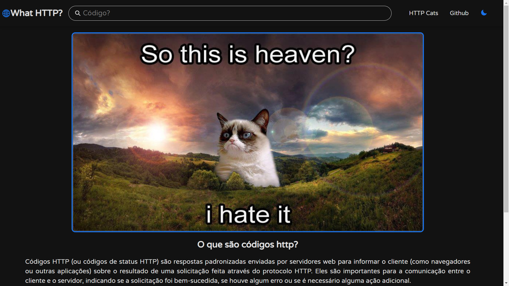

<h1>🌐 What HTTP?</h1>

## Tecnologias 🛠️

## Sobre ℹ️
O app consiste em um simples site que há a função de buscar um código HTTP para ver o que ele faz. Ele utiliza do [HTTP Cats](https://http.cat/) para gerar imagens divertidas sobre cada código HTTP. As informações de cada código também foram retiradas de lá, passando antes pelo Google Tradutor.

O objetivo de desenvolver ele foi aprender sobre Styled Components com React.

## Créditos do Favicon 🌟
<a href="https://www.flaticon.com/br/icones-gratis/design-do-site" title="design do site ícones">Design do site ícones criados por Good Ware - Flaticon</a>